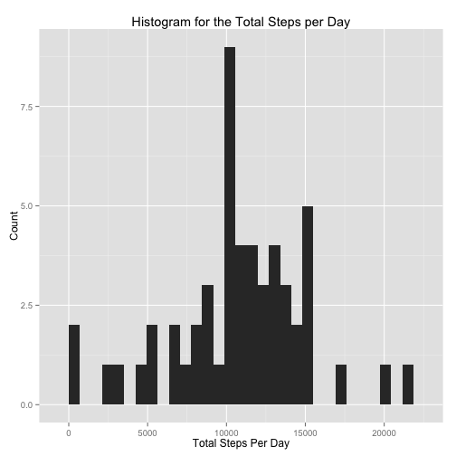
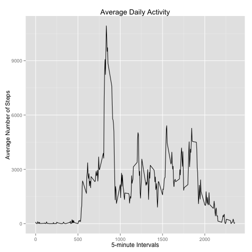
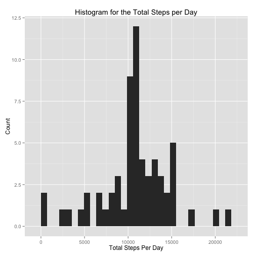
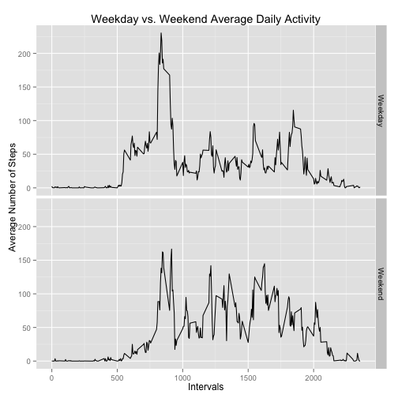

## Loading and preprocessing the data

```r
# Install, and load ggplot for plotting
if(!require("ggplot2")) {
    install.packages("ggplot2", repos="http://cran.rstudio.com/")
    library("ggplot2")
}

# Install, and load plyr for transformations
if(!require("plyr")) {
    install.packages("plyr", repos="http://cran.rstudio.com/")
    library("plyr")
}

# We are assuming the repository has been set as the working directory
activityFile <- unzip('activity.zip')

# Based upon this, we unzip, and read in the csv to a variable
activity <- read.csv(activityFile)
```

## What is mean total number of steps taken per day?

```r
# Aggregate the dataset, returning the sum total of steps each day
sumStepsPerDay <- aggregate(activity$steps, by=list(activity$date), FUN=sum)
colnames(sumStepsPerDay) <- c("day", "steps")

# Plot the aggregated results as a histogram
ggplot(data=sumStepsPerDay, aes(sumStepsPerDay$steps)) +
    geom_histogram() +
    labs(title="Histogram for the Total Steps per Day") +
    labs(x="Total Steps Per Day", y="Count")
```

 

```r
# Calculate the mean, and median values of steps per day
# Set appropriate formatting, for display purposes we want whole steps
meanSteps <- format(mean(sumStepsPerDay$steps, na.rm=TRUE), digits=5)
medianSteps <- format(median(sumStepsPerDay$steps, na.rm=TRUE), digits=5)
```
### Result
The **mean** number of steps per day is 10766, and the **median** is 10765.

## What is the average daily activity pattern?

```r
# Aggregate by interval, returning the sum total of steps across all days
cleanActivity <- activity[complete.cases(activity), ]
sumStepsPerInterval <- aggregate(cleanActivity$steps, by=list(cleanActivity$interval), FUN=sum)
colnames(sumStepsPerInterval) <- c("interval", "steps")

# Plot the aggregated results as a timeseries
ggplot(data=sumStepsPerInterval, aes(x=interval, y=steps)) +
    geom_line() +
    labs(title="Average Daily Activity") +
    labs(x="5-minute Intervals", y="Average Number of Steps")
```

 

```r
# Extract the interval with the maximum number of steps ([1] = interval, [2] = steps)
maxInterval <- sumStepsPerInterval[which.max(sumStepsPerInterval$steps), ][ 1 ]
```
### Result
The 5-minute interval with the maximum number of steps [on average] across all days is **835** mins.

## Imputing missing values
There are a large number of missing values, these are being replaced with the mean value for the given interval - across all days. 


```r
# Calculate the total number of missing values (intervals)
totalMissing <- table(is.na(activity$steps))["TRUE"]

# Aggregate by interval, returning the mean steps across all days
meanSteps <- tapply(activity$steps, activity$interval, mean, na.rm=TRUE)
meanStepsPerInterval <- data.frame(unique(activity$interval), meanSteps)
colnames(meanStepsPerInterval) <- c("interval", "steps")

# Function to get the imputed value from our calculated means, if missing
getImputeValueIfMissing <- function(steps, interval) {
    if(!is.na(steps))
        imputeVal <- steps
    else
        imputeVal <- meanStepsPerInterval[meanStepsPerInterval$interval==interval, "steps"]
    
    return(imputeVal)
}

# Now run the impute function over the dataset
imputedActivity <- activity
imputedActivity$steps <- mapply(getImputeValueIfMissing, activity$steps, activity$interval)

# Aggregate the dataset, returning the sum total of steps each day
sumStepsPerDay <- aggregate(imputedActivity$steps, by=list(imputedActivity$date), FUN=sum)
colnames(sumStepsPerDay) <- c("day", "steps")

# Finally, plot the new imputed dataset - where NA's are replaced with the mean
ggplot(data=sumStepsPerDay, aes(sumStepsPerDay$steps)) +
    geom_histogram() +
    labs(title="Histogram for the Total Steps per Day") +
    labs(x="Total Steps Per Day", y="Count")
```

 

```r
# Calculate the mean, and median values of steps per day
# Set appropriate formatting, for display purposes we want whole steps
meanSteps <- format(mean(sumStepsPerDay$steps, na.rm=TRUE), digits=5)
medianSteps <- format(median(sumStepsPerDay$steps, na.rm=TRUE), digits=5)
```
### Result
* There were a total of **2304** missing values, 
* The **mean** number of steps is now 10766, after imputation,
* The **median** number of steps is now 10766, after imputation.  

The estimates of the total daily number of steps have increased. This is because previously the *NA* values were being counted as *0*. After imputation, we repace these with the mean for the given interval.

## Are there differences in activity patterns between weekdays and weekends?

```r
# Add an additional factor variable representing whether it's a weekend, or weekday
imputedActivity$date <- as.Date(imputedActivity$date)
imputedActivity$dayType <- as.factor(ifelse(weekdays(imputedActivity$date) %in% c("Saturday", "Sunday"), "Weekend", "Weekday"))

# Now average the number of steps per weekday/weekend, based upon the processed dataset
sumStepsPerDay <- aggregate(imputedActivity$steps, 
    by=list(imputedActivity$interval, imputedActivity$dayType), FUN=mean)
colnames(sumStepsPerDay) <- c("interval", "dayType", "steps")

# Create a panel plot with the aggregated results, as a timeseries
ggplot(data=sumStepsPerDay, aes(x=interval, y=steps)) +
    geom_line() +
    facet_grid(dayType ~ .) +
    labs(title="Weekday vs. Weekend Average Daily Activity") +
    labs(x="Intervals", y="Average Number of Steps")
```

 

### Result  
From comparing the above plots, you can see that there is a greater number of steps on weekdays, when compared with weekends. In addition, it appears as though morning activity begins at later intervals on weekends.
